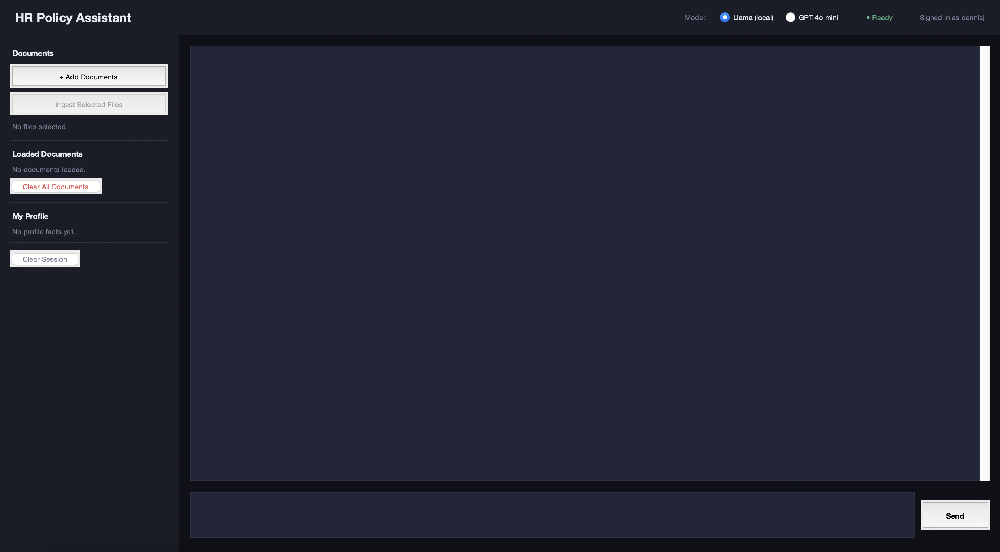
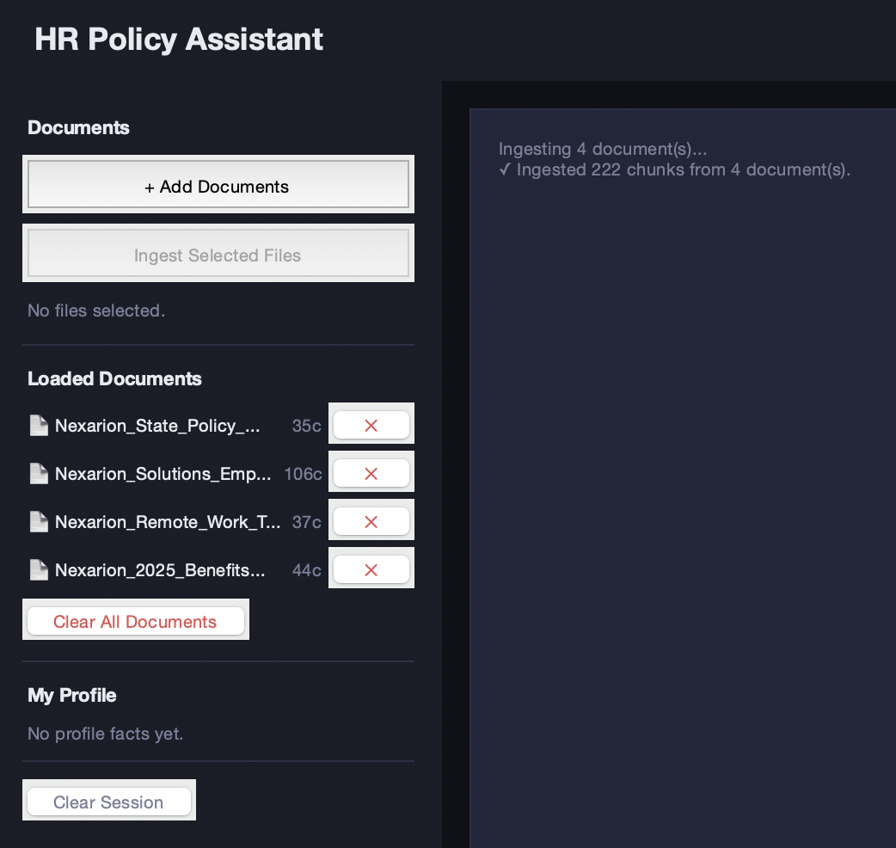
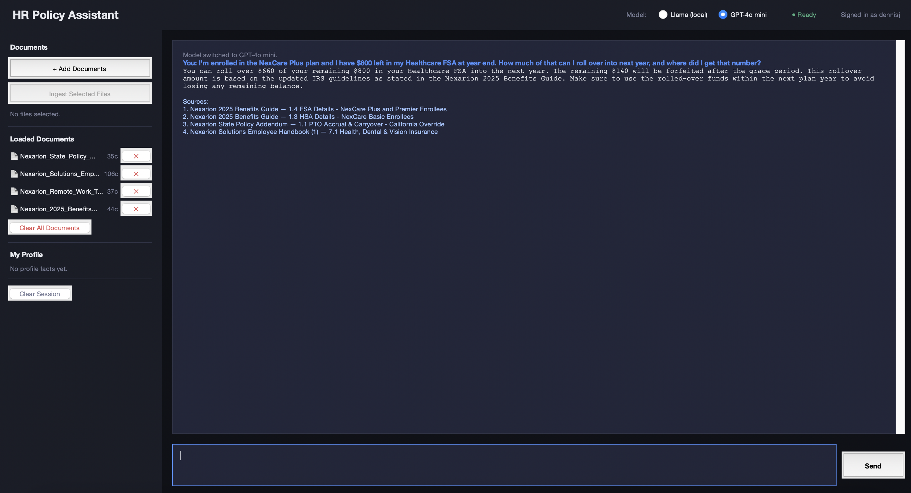
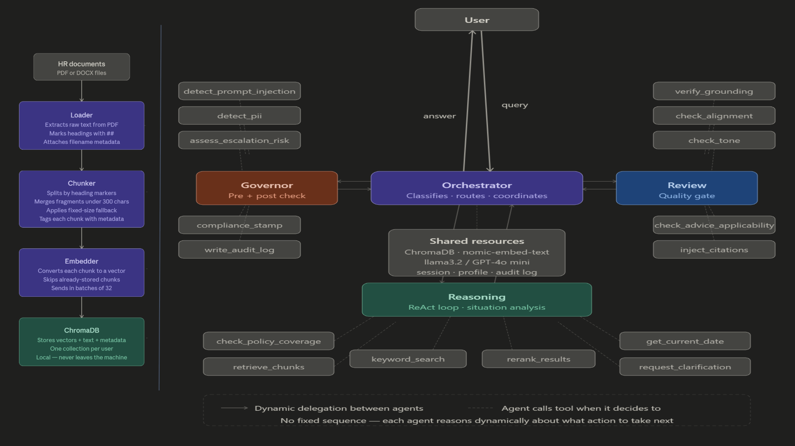

**Dennis Johnson | Analytics & AI Portfolio**

Recent graduate from Saint Joseph’s University with degrees in Business Intelligence & Analytics and Supply Chain Management. Passionate about leveraging analytics, AI, and data-driven decision-making to solve business problems and improve operational performance.

This portfolio contains selected academic projects focused on:
- Artificial Intelligence
- Business Analytics
- Supply Chain Analytics
- Data Visualization
- Business Strategy

---

# Featured Projects

## PolicyPro - AI HR Policy Assistant

PolicyPro is an AI-powered HR policy assistant that gives employees instant, accurate answers to their benefits and policy questions, grounded entirely in your company's own documents.

Built as a final project for the Agentic AI & Prompt Engineering course at Saint Joseph’s University.

### Project Overview
PolicyPro ingests HR policy documents (PDF/DOCX), processes them into embeddings, and enables conversational Q&A with strict grounding and compliance controls. The system is designed to ensure responses are traceable, policy-aligned, and safe for HR use cases.

### Key Features
- Multi-agent architecture with orchestrated workflow (Orchestrator → Governor → Reasoning → Review)
- Retrieval-Augmented Generation (RAG) using locally stored document embeddings
- Citation-based answers grounded in uploaded HR policy documents
- Prompt injection and PII detection layer before reasoning begins
- Compliance and escalation system for sensitive HR topics
- Audit logging of all interactions for traceability

### Model & Architecture
- Local LLM: Llama 3.2 via Ollama (default, fully offline)
- Optional cloud mode: GPT-4o mini for enhanced reasoning
- Embeddings: nomic-embed-text via Ollama
- Vector database: ChromaDB (per-user isolation)

### Security & Compliance Design
- Prompt injection and sensitive content filtering before response generation
- Automatic escalation of legal/HR-sensitive queries
- Final response review layer for grounding, tone, and policy alignment
- Audit log tracking (user, query, response, timestamp)

### Technologies Used
- Python
- Ollama (Llama 3.2)
- OpenAI API (optional GPT-4o mini mode)
- ChromaDB
- Retrieval-Augmented Generation (RAG)
- Multi-agent system design

### Contributors
- Dennis Johnson  
- Nick Zywalewski  

### Repository
[View Project Repository](https://github.com/nick-zywalewski/AgenticAI_FinalProject)

### Preview*

### 1. AI Chat Interface

This is the PolicyPro interface where users can ask HR policy questions and receive AI-generated, citation-backed responses.

### 2. Document Ingestion

Users can upload HR policy documents (PDF or DOCX), which are automatically chunked and embedded for retrieval.

### 3. Grounded Responses with Citations

All answers are grounded in uploaded HR documents, with source references to ensure transparency and reduce hallucinations.

### 4. Multi-Agent Architecture

All answers are grounded in uploaded HR documents, with source references to ensure transparency and reduce hallucinations.

---

## Tableau Dashboards

A collection of Tableau-based data visualization projects focused on operational insights and business intelligence, created during my time at Saint Joseph’s University.

### Areas Covered
- Supply Chain & Global Development Analytics
- Operational Risk Analysis
- Sustainability & ESG Reporting
- Sports Analytics
- Data Visualization & Dashboard Design

### Tools Used
- Tableau
- Excel
- Alteryx
- JMP
- Data Cleaning & Transformation
- Dashboard Design

---

## Featured Dashboards

### MLB Best Pitch 2024
Sports analytics dashboard evaluating MLB pitch performance using key metrics such as velocity, spin rate, and effectiveness to identify top-performing pitches.

[View Dashboard](https://public.tableau.com/views/MLBBestPitch2024/Dashboard1?:language=en-US&:sid=&:redirect=auth&:display_count=n&:origin=viz_share_link)

---

### Access to Drinking Water and Sanitation by Country
Interactive global analysis of access to clean drinking water and sanitation services, highlighting disparities across regions, income levels, and development indicators.

[View Dashboard](https://public.tableau.com/views/AccesstoDrinkingWaterandSanitationbyCountry/Dashboard1?:language=en-US&:sid=&:redirect=auth&:display_count=n&:origin=viz_share_link)

---

### Merck SDG Commitments
Sustainability-focused dashboard tracking Merck’s progress toward UN Sustainable Development Goals, emphasizing environmental and social impact metrics.

[View Dashboard](https://public.tableau.com/views/MerckSDGCommitments_17319683303880/Dashboard1?:language=en-US&:sid=&:redirect=auth&:display_count=n&:origin=viz_share_link)

---

### Bird Strike Trends
Analytical dashboard exploring bird strike incidents in aviation, identifying seasonal patterns, geographic hotspots, and operational risk trends over time.

[View Dashboard](https://public.tableau.com/views/BirdStrikeTrends/Dashboard1?:language=en-US&:sid=&:redirect=auth&:display_count=n&:origin=viz_share_link)

---

# Technical Skills

## Analytics & Data
- Tableau
- Excel
- Alteryx
- JMP
- Data Visualization
- Business Analytics

## Programming & AI
- Python
- Prompt Engineering
- LLM Applications
- Git/GitHub

## Business Areas
- Workforce Analytics
- Supply Chain Management
- Process Improvement
- Operational Analysis

---

# Contact

- LinkedIn: (www.linkedin.com/in/dennis-johnson-121346296)

- Tableau: (https://public.tableau.com/app/profile/dennis.johnson6387/vizzes)

